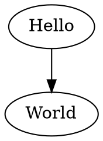
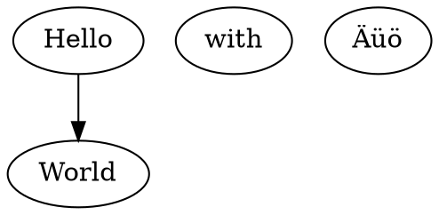

## 添加Graphviz的过滤器[12-02-2016 22:51:57 CST]

该过滤器也是直接由markdown来处理图片文件。这样的话可以在多种输出当中都支持图片的结构。

Use this

    ```
    digraph G {Hello->World}
    ```

to get 



with with Äüö




### 过滤器的写法

```
#!/usr/bin/env python3

"""
Pandoc filter to process code blocks with class "graphviz" into
graphviz-generated images.
"""

import graphviz
import hashlib
import os
import sys
from pandocfilters import toJSONFilter, Str, Para, Image


def sha1(x):
    return hashlib.sha1(x.encode(sys.getfilesystemencoding())).hexdigest()

imagedir = "target/graphviz-images"


def graphviz(key, value, format, meta):
    if key == 'CodeBlock':
        [[ident, classes, keyvals], code] = value
        caption = "caption"
        if "graphviz" in classes:
            G = graphviz.Graph(string=code)
            G.layout()
            filename = sha1(code)
            if format == "html":
                filetype = "png"
            elif format == "latex":
                filetype = "pdf"
            else:
                filetype = "png"
            alt = Str(caption)
            src = imagedir + '/' + filename + '.' + filetype
            if not os.path.isfile(src):
                try:
                    os.mkdir(imagedir)
                    sys.stderr.write('Created directory ' + imagedir + '\n')
                except OSError:
                    pass
                G.draw(src)
                sys.stderr.write('Created image ' + src + '\n')
            tit = ""
            return Para([Image([alt], [src, tit])])

if __name__ == "__main__":
    toJSONFilter(graphviz)
```


### 用Haskell写的dot的过滤器

```haskell
module DotPlugin (transform) where
import Text.Pandoc
import Text.Pandoc.Shared
import System.Process (readProcess)
import Data.Char (ord)
-- from the utf8-string package on HackageDB:
import Data.ByteString.Lazy.UTF8 (fromString)
-- from the SHA package on HackageDB:
import Data.Digest.Pure.SHA

-- This plugin allows you to include a graphviz "dot" diagram
-- in a document like this:
--
-- ~~~ {.dot name="diagram1"}
-- digraph G {Hello->World}
-- ~~~

transform :: Block -> IO Block
transform (CodeBlock (id, classes, namevals) contents) | "dot" `elem` classes = do
  let (name, outfile) =  case lookup "name" namevals of
                                Just fn   -> ([Str fn], fn ++ ".png")
                                Nothing   -> ([], uniqueName contents ++ ".png")
  result <- readProcess "dot" ["-Tpng"] contents
  writeFile outfile result
  return $ Para [Image name (outfile, "")]
transform x = return x

-- | Generate a unique filename given the file's contents.
uniqueName :: String -> String
uniqueName = showDigest . sha1 . fromString
```
